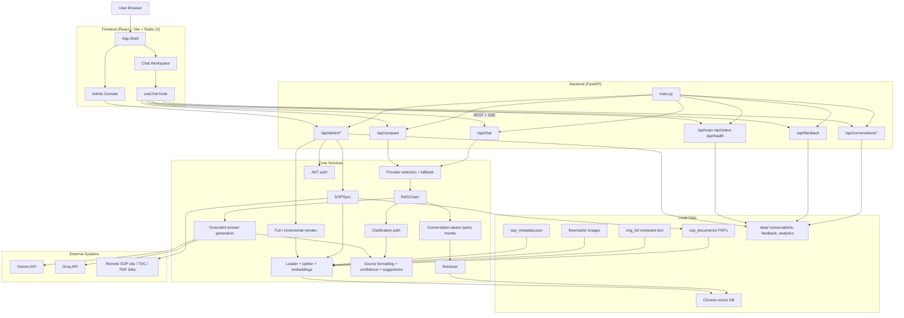
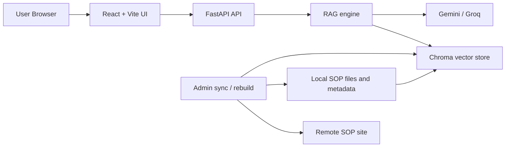
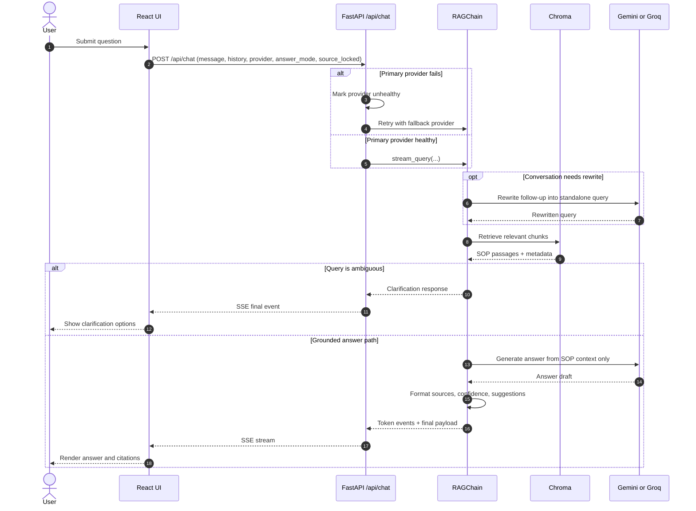
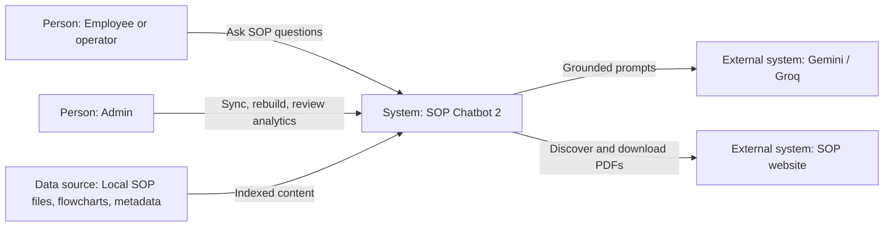
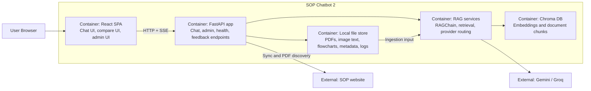
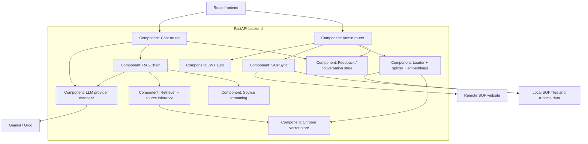

# Architecture Diagrams

These Mermaid diagrams reflect the current codebase structure in `SOP_Chatbot2`.

Related source files:

- `backend/main.py`
- `backend/api/chat.py`
- `backend/api/admin.py`
- `backend/core/rag_chain.py`
- `backend/core/sync.py`
- `backend/rag/loader.py`
- `frontend/src/hooks/useChat.ts`

Standalone Mermaid sources are also saved in this folder as:

- `architecture-flow.mmd`
- `architecture-readme.mmd`
- `chat-sequence.mmd`
- `c4-context.mmd`
- `c4-container.mmd`
- `c4-component.mmd`

## 1. Full Architecture Flow

## 2. Simplified README Diagram

## 3. Chat Request Sequence

## 4. C4 Context

## 5. C4 Container

## 6. C4 Component

